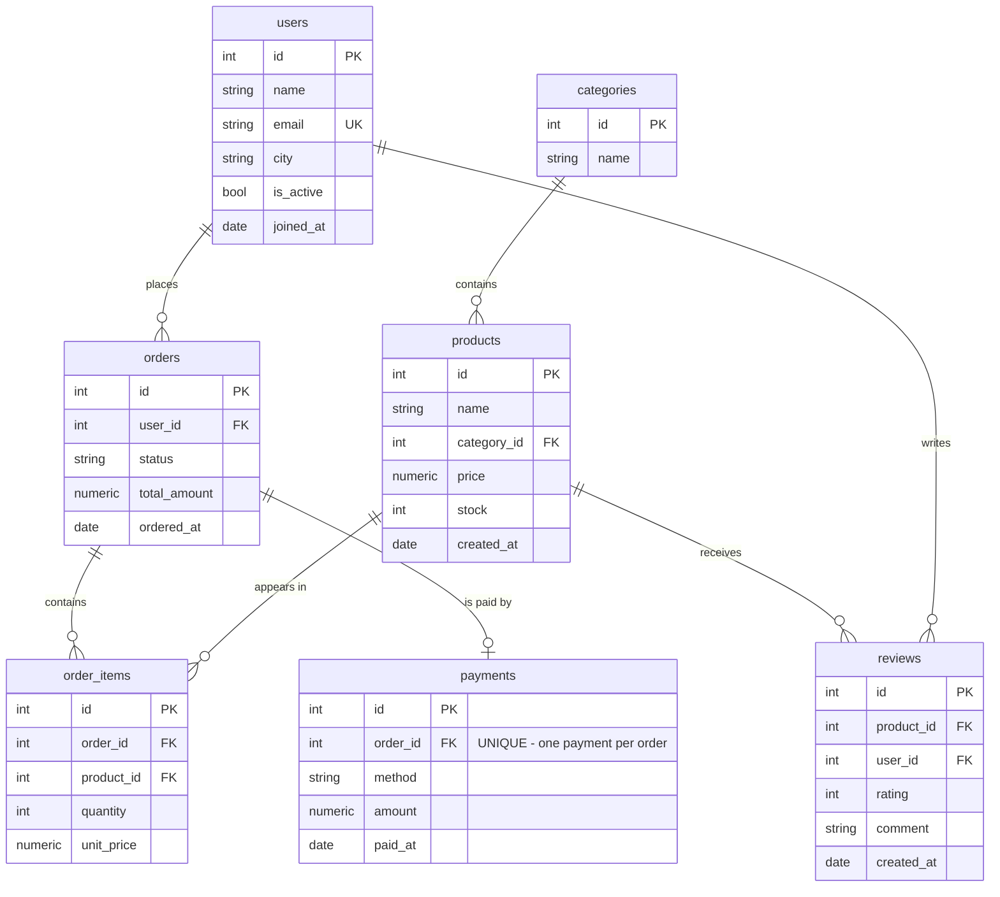

# 🛒 E-Commerce — ER Diagram

**Relationships:**
- `users 1—* orders` (one-to-many: a user places many orders)
- `orders 1—* order_items` (an order contains many items — the classic "line item" pattern)
- `products 1—* order_items` (a product appears in many orders — many-to-many between orders & products, resolved by order_items)
- `orders 1—0..1 payments` (one-to-optional-one: pending/cancelled orders may have no payment)
