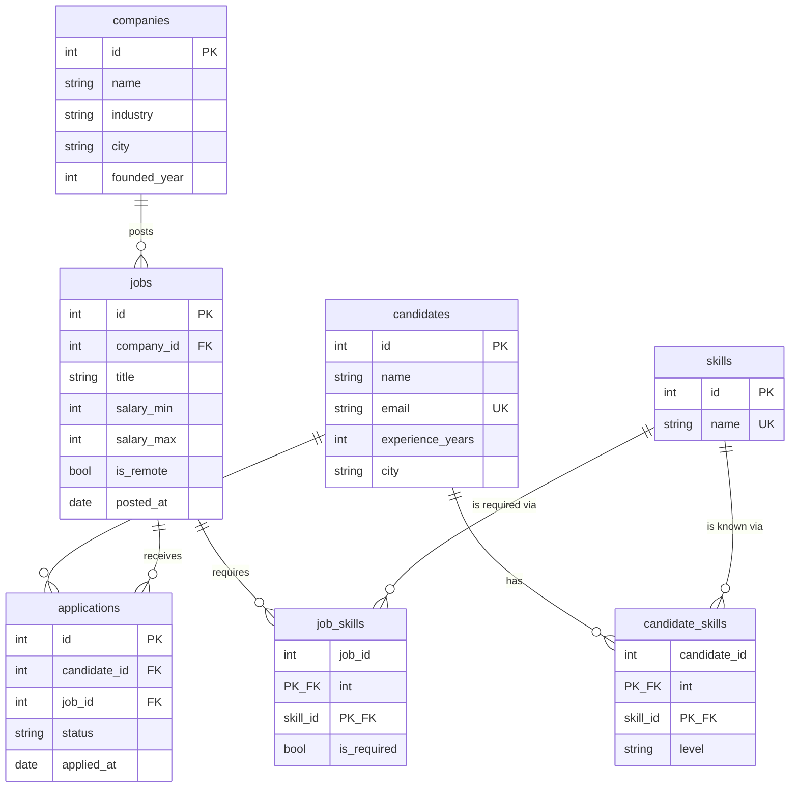

# 💼 Job Platform — ER Diagram

**Relationships:**
- `candidates *—* jobs` — a **many-to-many** resolved by the `applications` junction table (which carries extra data: status and date).
- `candidates *—* skills` and `jobs *—* skills` — two *more* many-to-many relationships, resolved by `candidate_skills` and `job_skills`. Note these junctions carry their own data (`level`, `is_required`).
- A classic interview exercise: "find candidates whose skills match a job's required skills" — solved by joining *both* junction tables.
