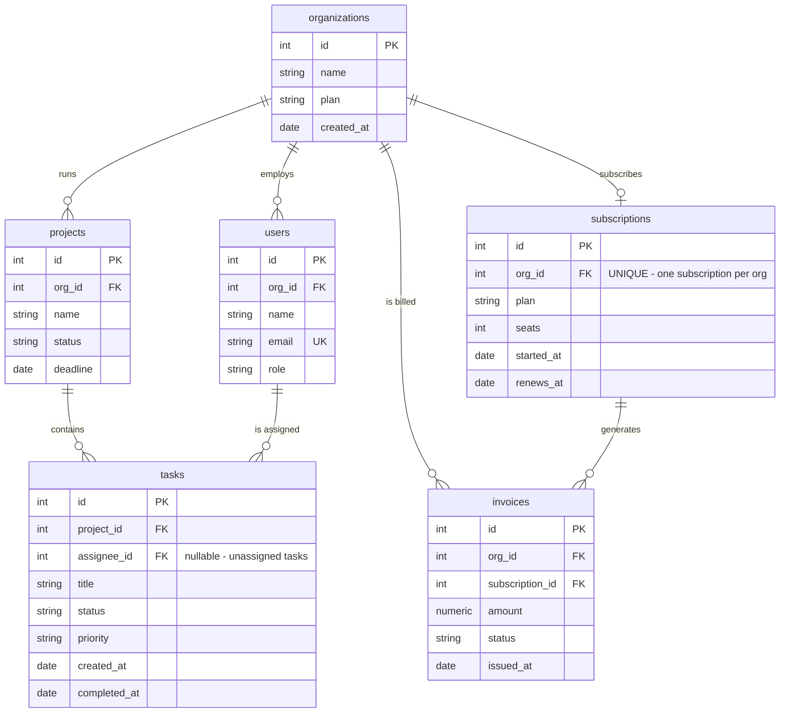

# SaaS Platform — ER Diagram

**Relationships:**
- `organizations 1—0..1 subscriptions` — one-to-one (each org has at most one active subscription; free plans have `renews_at = NULL`).
- `tasks.assignee_id` is **nullable** — the NULL here means "unassigned", a real-world design decision you'll explore in Day 7.
- `invoices` links to *both* the org and the subscription — redundant-looking, but each link answers a different common query.
