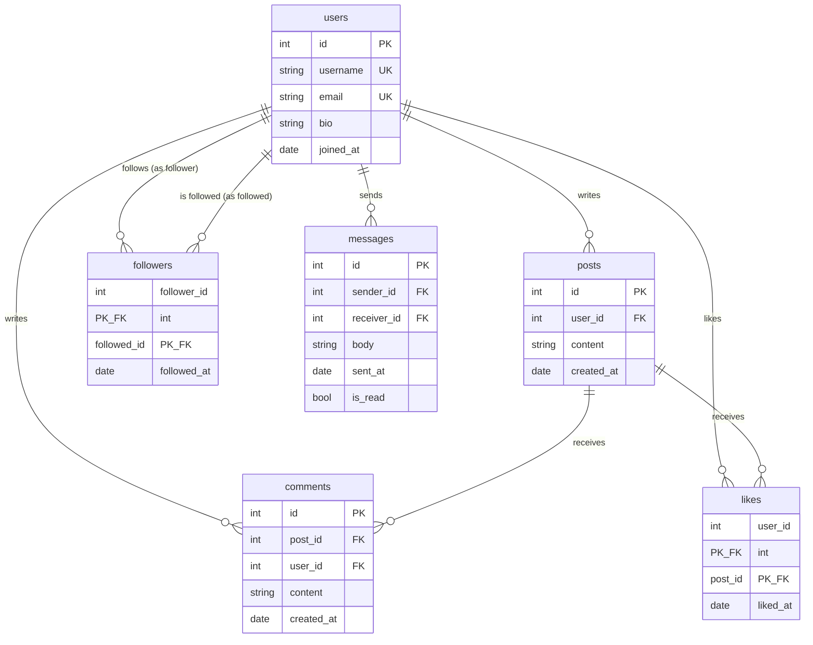

# 💬 Social Platform — ER Diagram

**Relationships:**
- `likes` and `followers` use **composite primary keys** — a like is identified by (user, post) together; no single column would be unique on its own.
- `followers` is a **self-referencing many-to-many**: both sides of the relationship are users. (The `follower_id <> followed_id` CHECK prevents following yourself.)
- `messages` references `users` **twice** (sender and receiver) — you'll need table aliases to join it.
